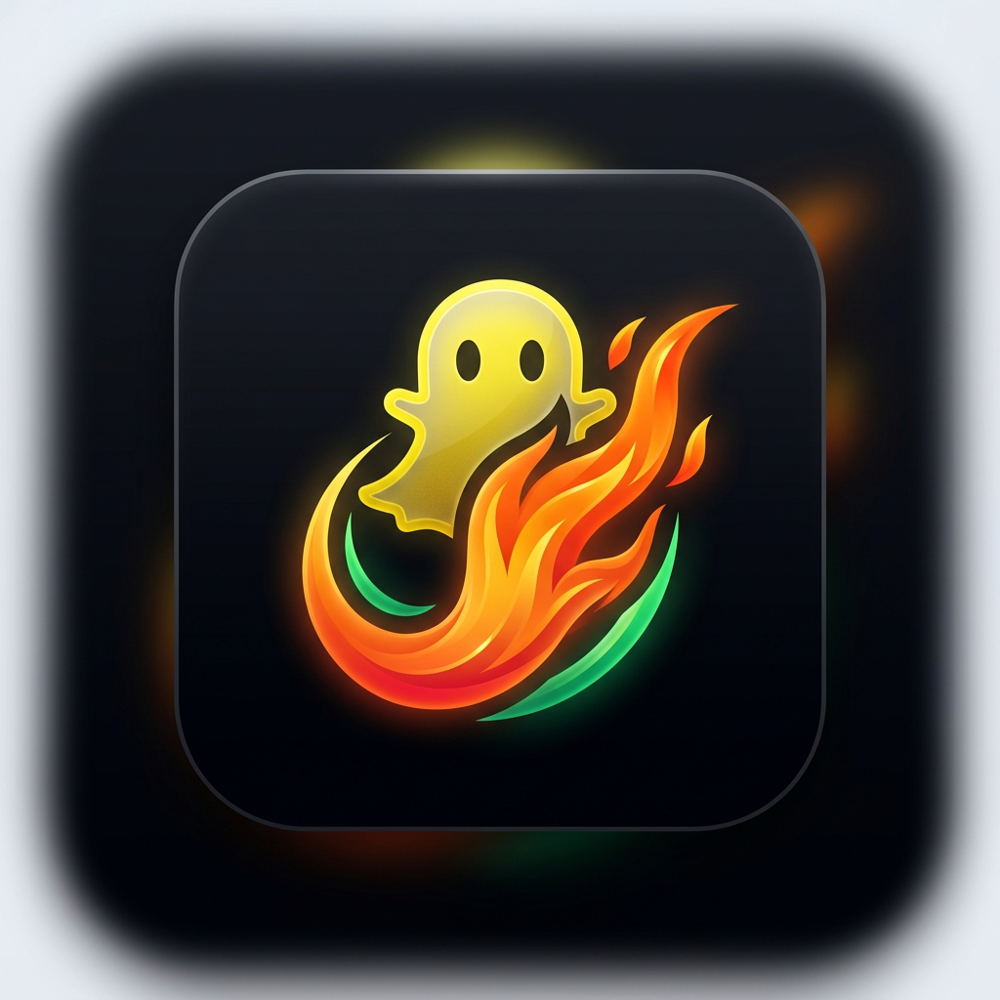

<div align="center">
  
  <h1>Snapchat Streak Recoverer</h1>
  <p><b>Advanced Automated Support Form Submitter</b></p>
  <p>
    Built with <strong>Playwright</strong> and <strong>CustomTkinter</strong>
  </p>
  <br/>
  <a href="https://github.com/abdulhaseeb2k/Snapchat-Streak-Recoverer/releases/latest">
    
  </a>
</div>

---

## 📖 Overview

**Snapchat Streak Recoverer** is an advanced, fully-featured desktop application designed to automate the tedious process of recovering lost Snapchat streaks. By leveraging Playwright for powerful browser automation and CustomTkinter for a sleek, modern, and responsive UI, this application allows users to manage multiple profiles, search through friends lists, and automate support form submissions with stealth and precision.

## ✨ Key Features

### 🛡️ Automation & Stealth
- **Optimized Recoverer Browser:** Uses a dedicated, isolated Chromium environment ensuring maximum reliability and zero interference with your daily browsing.
- **Stealth & Anti-Detection:** Deeply integrated with `playwright-stealth` to mimic real human behavior, mask automation flags, and bypass strict bot detection systems.
- **Automatic Form Submission:** Intelligently maps your profile data to Zendesk/Snapchat support forms, fills out all required fields, and submits them automatically.
- **CAPTCHA Bypass & Extension Support:** Natively supports loading unpacked Chrome extensions (like AdBlockers, VPNs, or auto-solvers). Comes bundled with **CaptchaSonic** to automatically bypass reCAPTCHA challenges.

### 👤 Profile & Data Management
- **Smart Profile Management:** Create, edit, and switch between multiple Snapchat accounts effortlessly.
- **Bulk Export & Import:** Export multiple profiles into a single JSON file for secure backups or sharing. When importing, the system automatically detects collisions and prevents overwriting existing data.
- **Local Privacy:** All your sensitive data (emails, usernames, phone numbers) is securely stored locally in `%APPDATA%`. Nothing is ever sent to a remote server or committed to version control.

### 💻 Modern User Interface
- **Adaptive UI:** A beautiful, fully responsive grid and list layout built with `CustomTkinter` that adapts to your window size.
- **Dynamic Search Filtering:** Instantly search through large friends lists by display name or username.
- **Real-Time Status Tracking:** Inline progress bars and status indicators track the recovery state for each friend in real-time.
- **Dark/Light Mode Support:** Seamlessly switches between system, dark, and light themes.

---

## 🏗️ Architecture & Data Flow

The application is built on an **MVC-inspired modular architecture** to maintain a clean separation between the UI, the Data layer, and the Automation Engine.

### Project Structure

```text
📦 Snapchat-Streak-Recoverer
├── 📄 app.py                     # Thin launcher
├── 📄 requirements.txt           # Project dependencies
├── 📄 README.md
├── 📄 LICENSE
├── 📄 build_exe.bat              # PyInstaller automated build script
├── 📄 installer_script.iss       # Inno Setup compiler script
├── 📂 assets/                    # UI and executable icons
│   ├── 🖼️ APP-ICONE.ico
│   └── 🖼️ UNINSTALL-ICONE.ico
├── 📂 extensions/                # Local Chrome extensions
│   └── 📂 captchasonic/          # Default Captcha Bypass Extension
├── 📂 data/                      # Local persistence (auto-generated)
│   ├── 📄 profiles.json
│   ├── 📄 app_settings.json
│   └── 📂 browser_profile/       # Playwright persistent context
└── 📂 src/
    ├── 📄 main.py                # App entry point & initialisation
    ├── 📄 constants.py           # Paths, version, colour palette, fonts
    ├── 📂 core/                  # Backend / Data Layer
    │   └── 📄 data_manager.py    # JSON persistence, profile & friend CRUD
    ├── 📂 automation/            # Browser Automation Layer
    │   └── 📄 recovery.py        # Playwright stealth automation & submission
    └── 📂 ui/                    # UI Layer (CustomTkinter)
        ├── 📄 app_window.py      # Main App window
        ├── 📂 components/        # Reusable widgets (cards, status bar)
        └── 📂 dialogs/           # Interactive pop-ups (settings, edits)
```

### Data Flow

```mermaid
graph LR
    A[app.py Launcher] --> B[src/main.py]
    B --> C[Data Manager (Persistence)]
    B --> D[CustomTkinter AppWindow]
    D -->|Reads/Writes Profiles| C
    D -->|Spawns Async Thread| E[Playwright Recovery Engine]
    E -->|Status Callbacks| D
    C -->|JSON Serialization| F[(%APPDATA% / Local Storage)]
```

---

## 🚀 Getting Started (Source Code)

### Prerequisites
- Python 3.10 or higher
- Git

### Installation

1. **Clone the Repository**
   ```bash
   git clone https://github.com/abdulhaseeb2k/Snapchat-Streak-Recoverer.git
   cd Snapchat-Streak-Recoverer
   ```

2. **Install Python Dependencies**
   ```bash
   pip install -r requirements.txt
   ```

3. **Install Playwright Browser Binaries**
   ```bash
   playwright install chromium
   ```

4. **Run the Application**
   ```bash
   python app.py
   ```

---

## 📦 Building the Standalone Executable (.exe)

You can easily package the application into a professional Windows Installer (`.exe`), complete with custom App Icons and Uninstaller Icons.

**Requirements:**
- You must have [Inno Setup 6](https://jrsoftware.org/isinfo.php) installed on your Windows machine.

**Build Steps:**
1. Ensure your Python path inside `build_exe.bat` matches your local environment.
2. Run the automated build script:
   ```cmd
   build_exe.bat
   ```
3. The script will:
   - Clean up old build directories.
   - Force-download a local copy of Chromium so the `.exe` is entirely self-contained.
   - Run **PyInstaller** to freeze the code, bundle the `playwright-stealth` JS assets, bundle the `assets/` icons, and bundle the `extensions/` directory.
   - Run **Inno Setup** to compile the final `.exe`.
4. Your final installer will be generated inside the `installer_output/` directory as `Snapchat_Streak_Recoverer_Setup.exe`.

---

## 🧩 Browser Extensions & CaptchaSonic

The application allows you to load **unpacked Chrome Extensions** directly into the automation browser.

### Using the Built-in CaptchaSonic Extension
By default, the application comes bundled with the **CaptchaSonic** extension (located in `extensions/captchasonic`). This extension is designed to automatically bypass CAPTCHAs.
- To use it, simply insert your **API Key** into the CaptchaSonic files.
- If you don't select a custom extension in the App Settings, the automation engine will automatically locate and load this default package.

### Loading a Custom Extension
If you want to use your own extension (like a specific VPN or proxy):
1. Extract your `.crx` extension file into a folder (it must contain a `manifest.json`).
2. Open the **App Settings** (⚙️ icon in the bottom right corner).
3. Under **Browser Extension Path**, click **Browse** and select your unpacked folder.
4. The extension will be persistently loaded in all future automation sessions.

---

## 💡 How it Works

1. **Profile Setup:** Open the app and create a profile. Enter your Snapchat Username, Email, Phone Number, and Device Type.
2. **Add Friends:** Add the usernames of the friends whose streaks you want to recover.
3. **Select & Search:** Use the search bar to filter your list, and check the boxes next to the friends you want to process.
4. **Execute:** Click **Recover Selected Streaks**.
5. **Sit Back:** The app launches the stealth browser, navigates to the Snapchat Support page, meticulously fills out the recovery form for each friend, solves the CAPTCHA (if configured), and hits submit.

---

## 👨‍💻 Developer
Developed and maintained by **Abdul Haseeb**.

## 📄 License
This project is licensed under the **MIT License**. See the [LICENSE](LICENSE) file for more details.
