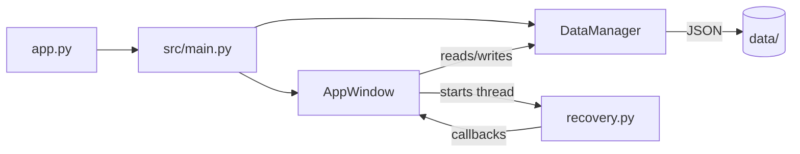

# Snapchat Streak Recoverer

An advanced, multi-profile desktop application designed to automate the Snapchat Streak Recovery process. Built with **Playwright** for browser automation and **CustomTkinter** for a modern, responsive UI.

## Features

- **Multi-Profile Management** — Support for multiple Snapchat accounts with separate friend lists.
- **Adaptive Grid UI** — Responsive card layout that adjusts to your screen size with hover effects.
- **Smart Automation** — Automatically fills support forms for selected friends one by one.
- **Chrome Profile Detection** — Select from your existing Google Chrome profiles for browser automation.
- **Real-Time Status Bar** — Inline progress indicator instead of popup dialogs.
- **Account Detail Privacy** — All profile data is stored locally and never committed to Git.

## Architecture

The application follows an **MVC-inspired** modular architecture with clear separation of concerns:

```
Snapchat-Streak-Recoverer/
├── app.py                     # Thin launcher
├── requirements.txt
├── README.md
├── LICENSE
├── .gitignore
├── data/                      # User data (gitignored)
│   ├── profiles.json
│   └── app_settings.json
└── src/
    ├── main.py                # App entry point & initialisation
    ├── constants.py           # Paths, version, colour palette, fonts
    │
    ├── core/                  # Backend / Data Layer
    │   ├── data_manager.py    # JSON persistence, profile & friend CRUD
    │   └── chrome_profiles.py # Chrome profile detection (Windows)
    │
    ├── automation/            # Browser Automation Layer
    │   └── recovery.py        # Playwright form-filling & submission
    │
    └── ui/                    # UI Layer (CustomTkinter)
        ├── app_window.py      # Main App window (header, body, footer)
        ├── components/        # Reusable widgets
        │   ├── friend_card.py   # Grid card with hover effects
        │   ├── friend_row.py    # List row with hover effects
        │   └── status_bar.py    # Bottom progress bar
        └── dialogs/           # Pop-up windows
            ├── profile_menu.py      # Switch profile
            ├── profile_details.py   # Edit/Create profile
            ├── friend_edit.py       # Edit friend
            ├── app_settings.py      # Global settings
            ├── help_window.py       # Help & instructions
            └── about_window.py      # About developer
```

### Data Flow



| Layer | Responsibility |
|-------|---------------|
| **`src/core/`** | Data persistence, profile/friend CRUD, Chrome detection |
| **`src/automation/`** | Playwright browser control, form filling |
| **`src/ui/`** | All CustomTkinter widgets, layout, user interaction |
| **`src/constants.py`** | Single source of truth for paths, colours, fonts |

## Getting Started

### Prerequisites
- Python 3.10+
- [Conda](https://docs.conda.io/en/latest/) (Recommended)

### Installation
1. Clone the repository:
   ```bash
   git clone https://github.com/abdulhaseeb2k/Snapchat-Streak-Recoverer.git
   cd Snapchat-Streak-Recoverer
   ```

2. Install dependencies:
   ```bash
   pip install -r requirements.txt
   ```

3. Install Playwright browsers:
   ```bash
   playwright install chromium
   ```

### Usage
```bash
python app.py
```

## Known Issues

| Issue | Status | Workaround |
|-------|--------|------------|
| **Chrome Profile Launch Hang** — When using a real Chrome profile, the browser may open but stay on `about:blank`. This is caused by Chrome's singleton lock mechanism preventing Playwright from controlling an existing profile session. | 🟡 Open | Use **"Test Browser (No Profile)"** instead. Close ALL Chrome processes before attempting profile-based automation. |

## Developer
Developed by **Abdul Haseeb**.

## License
[MIT](LICENSE)
